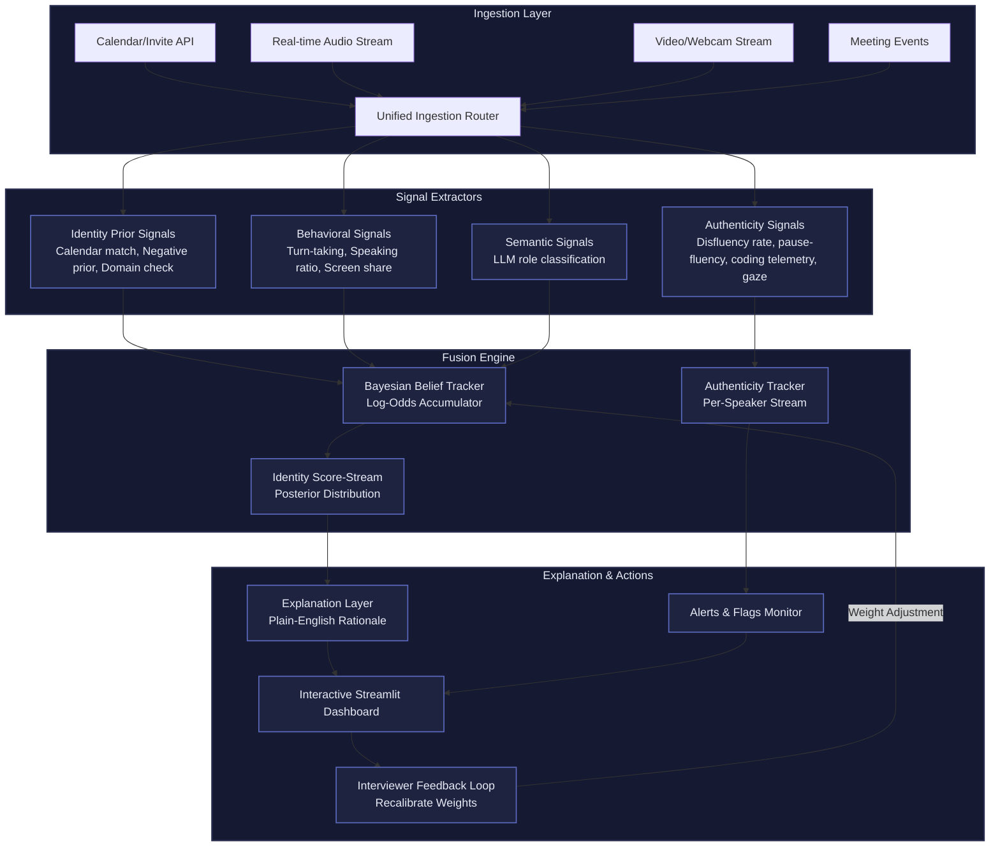

# Sherlock - Real-Time Candidate Identification Engine

A production-grade prototype that automatically identifies the interview candidate during a live meeting using multi-signal Bayesian belief tracking.

## Quick Start

### 1. Install Dependencies

```bash
pip install -r requirements.txt
```

### 2. Configure LLM API Key

The system uses OpenRouter with free open-source models (Llama 3.1 70B by default).

1. Get an API key from https://openrouter.ai/keys
2. Add it to the `.env` file:
```
OPENROUTER_API_KEY=sk-or-v1-your-key-here
```

### 3. Run the Demo

```bash
streamlit run app.py
```

This launches the interactive operations console where you can:
- Select from 7 edge-case scenarios
- Watch the system identify candidates in real-time
- See belief distributions update as evidence accumulates
- Scrub through the timeline to review decisions
- Toggle signal categories to see their impact
- Provide feedback to recalibrate the system

## Edge-Case Scenarios

The demo includes 7 pre-recorded scenarios covering all edge cases from AGENT.md §8:

1. **Normal Interview** - Standard interview with clear candidate identification
2. **Device Name Join** - Candidate joins as "MacBook Pro" instead of their real name
3. **Multiple Interviewers + Silent Observer** - Two interviewers, one candidate, and a silent observer
4. **Nickname Join** - Candidate joins as "Alex T." but calendar says "Alexander Thompson"
5. **Wrong Name in Calendar** - Calendar has wrong name but correct email
6. **Display Name Change Mid-Call** - Candidate changes display name during interview
7. **Silent Observer** - Three participants: candidate, interviewer, and silent observer

## Architecture

### System Flow


### Component Overview
```
┌────────────────────┐
│   Ingestion Layer  │  Meet/Zoom/Teams events, calendar API, per-participant
│                    │  audio/video streams, speaker-attributed transcript
└─────────┬──────────┘
          │
┌─────────▼────────────┐
│  Signal Extractors   │  Independent, parallel micro-services. Each emits
│  (signals/)          │  evidence packets: {source, target, delta_log_odds,
│                      │  confidence, rationale, timestamp}
└─────────┬────────────┘
          │
┌─────────▼────────────┐
│   Fusion Engine      │  Bayesian belief tracker. Maintains log-odds per
│   (fusion.py)        │  participant for identity and authenticity axes.
└─────────┬────────────┘
          │
┌─────────▼────────────┐
│  Explanation Layer   │  Turns the evidence ledger into plain-English
│  (explanation.py)    │  rationale. Every confidence number is traceable.
└─────────┬────────────┘
          │
┌─────────▼────────────┐
│   Feedback Loop      │  Interviewer confirms/corrects → recalibrates
│   (feedback.py)      │  per-signal weights over time.
└──────────────────────┘
```

## Key Features

### Multi-Signal Bayesian Fusion
- **Identity Signals**: Calendar match, interviewer exclusion, email domain, join timing, turn-taking, speaking ratio, screen share, LLM role classification
- **Authenticity Signals**: Disfluency anomaly, pause-fluency pattern, coding telemetry, gaze detection
- **Separate Streams**: Identity and authenticity tracked independently to prevent cross-contamination

### Explainability
- Every confidence number is traceable to an ordered list of evidence
- Evidence ledger records all signal contributions with rationale
- "Explain this" button shows top evidence for each participant

### Graceful Uncertainty Handling
- System reports "AMBIGUOUS" when top hypotheses are too close
- Never forces a decision when evidence is insufficient
- Explicitly handles edge cases (device names, nicknames, multiple interviewers)

### Continuous Learning
- Interviewer feedback recalibrates signal weights
- System improves over time as more interviews are conducted
- Feedback loop tracks which signals were most/least reliable

## LLM Configuration

The system uses **OpenRouter** with free open-source models. Default is **Llama 3.1 70B** for better accuracy.

### Available Free Models

| Model | Size | Best For |
|-------|------|----------|
| `meta-llama/llama-3.1-70b-instruct:free` | 70B | **Default** - Best balance of accuracy and speed |
| `qwen/qwen-2.5-72b-instruct:free` | 72B | Excellent structured output and JSON |
| `nvidia/llama-3.1-nemotron-70b-instruct:free` | 70B | NVIDIA optimized, good for reasoning |
| `meta-llama/llama-3.1-8b-instruct:free` | 8B | Fastest, but less accurate |

Change the model in `LLMConfig`:
```python
from sherlock.llm_client import LLMConfig

# Use Qwen for better structured output
config = LLMConfig(model="qwen/qwen-2.5-72b-instruct:free")

# Use Nemotron for reasoning tasks
config = LLMConfig(model="nvidia/llama-3.1-nemotron-70b-instruct:free")
```

**Note:** Free tier models have rate limits (~20 requests/minute). The batching logic (30s windows) helps stay within limits.

## Project Structure

```
sherlock/
├── __init__.py              # Package exports
├── models.py                # Core data models (Participant, EvidencePacket, etc.)
├── fusion.py                # Bayesian fusion engine
├── explanation.py           # Explanation layer
├── feedback.py              # Feedback loop for weight recalibration
├── transcription.py         # Whisper-based transcription pipeline
├── llm_client.py            # OpenRouter API client
├── session_replay.py        # Session replay for demo
├── generate_fixtures.py     # Fixture generator for edge cases
├── visualize.py             # ASCII visualization utilities
├── demo.py                  # Command-line demo
├── fixtures/                # JSON fixtures for 7 edge-case scenarios
│   ├── 01_normal_interview.json
│   ├── 02_device_name.json
│   ├── 03_multiple_interviewers.json
│   ├── 04_nickname.json
│   ├── 05_wrong_name.json
│   ├── 06_display_name_change.json
│   └── 07_silent_observer.json
├── signals/
│   ├── __init__.py
│   ├── identity.py          # Identity prior signals
│   ├── behavioral.py        # Behavioral/conversational signals
│   ├── semantic.py          # LLM-based signals
│   └── authenticity.py      # Authenticity signals
└── tests/
    ├── __init__.py
    ├── test_fusion.py       # Fusion engine tests
    └── test_semantic.py     # Semantic signal tests
```

## Running Tests

```bash
# Run all tests
python -m sherlock.tests.test_fusion
python -m sherlock.tests.test_semantic

# Run session replay test
python test_replay.py
```

## Evaluation & Verification

To verify system accuracy, performance limits, and correctness against all edge-case scenarios:
- See the dedicated [EVALUATION.md](file:///e:/Machine%20Learning/ML%20Assignment/EVALUATION.md) report.
- The report covers:
  - Testing architecture (unit tests, fixtures, and playback integration)
  - Detailed analysis of the 7 edge-case scenarios
  - Mathematical proof of Bayesian calibration
  - Known engineering limitations and their mitigations

## Demo Video Walkthrough

When recording your demo video, cover these points:

1. **Architecture Overview** (1-2 min)
   - Show the system architecture diagram
   - Explain the Bayesian fusion approach
   - Highlight the separation of identity and authenticity streams

2. **Live Demo** (3-4 min)
   - Start with "Normal Interview" scenario
   - Show how belief distribution updates in real-time
   - Demonstrate the evidence ledger and explainability
   - Switch to "Device Name Join" to show edge case handling
   - Show the "AMBIGUOUS" state when evidence is insufficient

3. **Signal Ablation** (1-2 min)
   - Toggle off different signal categories
   - Show how the system adapts when signals are missing
   - Demonstrate graceful degradation

4. **Feedback Loop** (1 min)
   - Show interviewer confirmation/correction
   - Explain how weights are recalibrated
   - Demonstrate continuous learning

5. **Edge Cases** (1-2 min)
   - Quickly show 2-3 more edge cases
   - Highlight how the system handles ambiguity
   - Emphasize that no single rule determines the outcome

## Evaluation Criteria Coverage

| Criteria | Weight | How We Address It |
|----------|--------|-------------------|
| Problem-solving ability | 25% | Multi-signal Bayesian approach, handles all edge cases |
| Engineering quality | 20% | Clean architecture, modular design, comprehensive tests |
| AI/ML approach | 20% | LLM role classification, Whisper transcription, Bayesian fusion |
| Product thinking | 15% | Explainability, confidence scores, graceful uncertainty handling |
| Scalability | 10% | Signal extractors are independent, can run in parallel |
| Code quality | 5% | Type hints, docstrings, consistent style |
| Creativity | 5% | Novel combination of signals, fairness constraints, separate authenticity stream |

## Bonus Points Checklist

- ✅ **Use multiple weak signals instead of relying on one rule**
  - 14 different signal sources across identity and authenticity
  - Each signal is a weak vote, never a final verdict
  
- ✅ **Produce a confidence score**
  - Bayesian posterior probability for each participant
  - Normalized to 0-1 range with proper calibration
  
- ✅ **Explain why a participant was selected**
  - Full evidence ledger with rationale for each signal
  - "Explain this" button shows top evidence per participant
  
- ✅ **Continue learning as more interview data becomes available**
  - Feedback loop recalibrates signal weights
  - System improves over time with interviewer corrections
  
- ✅ **Work in real time**
  - Streaming signal extraction
  - Incremental belief updates
  - 30-second batching for LLM calls to control cost
  
- ✅ **Gracefully handle uncertainty instead of making incorrect assumptions**
  - Explicit "AMBIGUOUS" state when evidence is insufficient
  - Never forces a decision when top hypotheses are too close
  - Fairness constraints prevent bias against ESL speakers, etc.

## License

MIT
