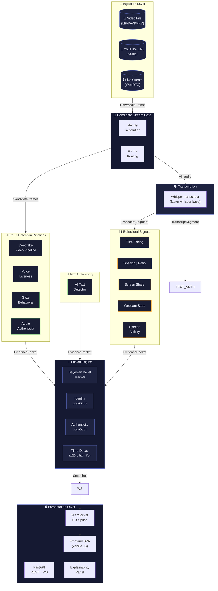

# Sherlock — Real-Time Candidate Identification & Authenticity Engine

A production-grade prototype that automatically identifies the interview candidate
during a live meeting using **multi-signal Bayesian belief tracking**. Sherlock fuses
14+ independent weak signals — never a single hard rule — to produce a continuously
updating confidence score with full explainability.

---

## Quick Start

### 1. Install dependencies

```bash
pip install -r requirements.txt
```

### 2. Start the backend

```bash
python3 -m uvicorn server:app --host 0.0.0.0 --port 8000 --log-level info
```

### 3. Open the frontend

Visit **http://localhost:8000** in your browser.

From there you can:
- Upload a local video file
- Paste a YouTube link (auto-downloaded via yt-dlp)
- Type a local file path
- Start live analysis and watch identity + authenticity scores update in real time

---

## Architecture

### High-Level System Diagram



### Data Flow (Detailed)

```
 ┌─────────────────────────────────────────────┐
 │              INGESTION LAYER                 │
 │  MediaSource → RawMediaFrame                 │
 │  (video frames, audio chunks, participant ID)│
 └──────────────────┬──────────────────────────┘
                    │
     ┌──────────────┴───────────────┐
     │                              │
     ▼                              ▼
 ┌──────────────┐          ┌──────────────────┐
 │ TRANSCRIPTION│          │ CANDIDATE GATE    │
 │ Pipeline     │          │ (identity-based   │
 │ (faster-     │          │  frame routing)   │
 │  whisper)    │          └───────┬──────────┘
 └──────┬───────┘                  │
        │                          ▼
        │          ┌───────────────────────────┐
        │          │  FRAUD DETECTION PIPELINES│
        │          │  • Deepfake Video         │
        │          │  • Voice Liveness         │
        │          │  • Gaze Behavioral        │
        │          │  • Audio Authenticity     │
        │          └────────────┬──────────────┘
        │                       │
        ▼                       │
 ┌──────────────┐               │
 │ TEXT AUTH    │               │
 │ Pipeline     │               │
 │ (roberta-    │               │
 │  base AI     │               │
 │  detector)   │               │
 └──────┬───────┘               │
        │                       │
        ▼                       ▼
 ┌─────────────────────────────────────────────┐
 │            FUSION ENGINE                    │
 │  Per-participant Bayesian beliefs:          │
 │  • identity_log_odds  (P = 1/(1+e^(-L)))    │
 │  • authenticity_log_odds                    │
 │  • Evidence ledger with full traceability   │
 │  • Time-decay (120 s half-life)             │
 └──────────────────┬──────────────────────────┘
                    │
                    ▼
 ┌─────────────────────────────────────────────┐
 │           PRESENTATION LAYER                  │
 │  FastAPI REST API + WebSocket                 │
 │  → Live dashboard with explainability panel   │
 └─────────────────────────────────────────────┘
```

---

## Core Components

### 1. Fusion Engine (`sherlock/fusion.py`)

The heart of Sherlock. Maintains per-participant `BeliefState` objects with
identity and authenticity **log-odds**. Every incoming `EvidencePacket` shifts
the log-odds by `delta_log_odds × signal_weight`.

| Signal Weight | Default | Description |
|---|---|---|
| `(calendar_match, identity)` | 3.0 | Heavily weights prior identity knowledge |
| `(turn_taking, identity)` | 2.0 | Responses to questions |
| `(deepfake_video, authenticity)` | -3.0 | Strong negative if deepfake detected |
| `(ai_generated_text, authenticity)` | -2.5 | AI-generated text detection |
| `(human_spontaneous_text, authenticity)` | +var | Positive: genuine-sounding answers |

Probability is recovered via logistic function: `P = 1 / (1 + exp(-log_odds))`

Time-decay (`DECAY_HALF_LIFE_SEC = 120`) prevents stale evidence from
dominating the belief indefinitely.

### 2. Signal Extractors (`sherlock/signals/`)

| Extractor | File | Axis | Sources |
|---|---|---|---|
| Identity Priors | `identity.py` | IDENTITY | calendar_match, interviewer_negative, email_domain, join_timing, display_name_change |
| Behavioral | `behavioral.py` | IDENTITY | turn_taking, speaking_ratio, screen_share, webcam_state |
| Semantic (LLM) | `semantic.py` | IDENTITY | llm_role_classifier |
| Authenticity | `authenticity.py` | AUTHENTICITY | disfluency_anomaly, pause_fluency_pattern, coding_telemetry |

### 3. Fraud Detection Pipelines (`sherlock/pipelines/`)

| Pipeline | File | What it detects |
|---|---|---|
| **Deepfake Video** | `deepfake.py` | Face anti-spoofing (MediaPipe FaceMesh + ResNet detector) |
| **Voice Liveness** | `voice_liveness.py` | Voice cloning/spoofing (Resemblyzer voiceprint drift) |
| **Gaze Behavioral** | `gaze_cv.py` | Screen-reading patterns (looking away, unnatural stillness) |
| **Audio Authenticity** | `audio_authenticity.py` | AI-generated speech (SpeechBrain AASIST) |
| **Text Authenticity** | `text_authenticity.py` | AI-generated text (roberta-base-openai-detector), reading patterns, unnatural pauses |
| **Live Transcription** | `transcription_live.py` | Speech-to-text (faster-whisper base model) |

### 4. Candidate Stream Gate (`sherlock/gate.py`)

Routes **only** the candidate's audio/video frames to the fraud-detection
pipelines. Interviewer and observer frames are dropped. Emits `identity_uncertain`
flags when the top two hypotheses are too close.

### 5. Real-Time Orchestrator (`sherlock/orchestrator.py`)

Async main loop that wires everything together:
- Reads `RawMediaFrame` from a `MediaSource` (file/YouTube/WebRTC)
- Runs transcription on **all** audio chunks
- Routes candidate frames through the gate
- Runs all pipelines and ingests evidence into the `FusionEngine`
- Backpressure via bounded queues (MAX_QUEUE=30) and stale-frame drops (1 s)

### 6. Live Session (`sherlock/live.py`)

Thread-safe wrapper that runs the orchestrator in a background thread with its
own `asyncio` event loop. Exposes `start()`, `stop()`, and `refresh_status()`.

### 7. Presentation Layer (`server.py` + `frontend/`)

**Backend** — FastAPI server providing:
- REST endpoints: `/api/live/upload`, `/api/live/start`, `/api/live/stop`, `/api/live/status`, `/api/live/video`, `/api/live/info`
- WebSocket: `/ws/live` — pushes full dashboard snapshots ~3× per second
- WebSocket: `/ws/replay` — pushes fixture replay snapshots
- Static file serving for the frontend SPA

**Frontend** — Vanilla JS SPA (`index.html`, `app.js`, `styles.css`) with:
- Video player with live identity/authenticity score bars
- **"Why This Candidate?" explainability panel** — evidence breakdown by source, pipeline status, top contributing signals, ambiguity warnings
- Verdict card with multi-signal reasoning
- Flagged speech segments panel
- Scoreboard with belief distribution bars
- Tabs: Monitor, Flags & Alerts, Evidence Room, Timeline/Transcript, Candidate Info
- Scenario replay for 7 edge-case fixtures
- Interviewer feedback (confirm/correct/notes)

---

## API Endpoints

### Live Analysis

| Method | Endpoint | Description |
|---|---|---|
| GET | `/api/live/available` | Check if live analysis dependencies are installed |
| POST | `/api/live/upload` | Upload a video file, returns `upload://` token |
| POST | `/api/live/start` | Start analysis (file_path, youtube_url, or upload token) |
| POST | `/api/live/stop` | Stop current analysis |
| GET | `/api/live/status` | Dashboard-compatible status snapshot |
| GET | `/api/live/video` | Serve current video file |
| GET | `/api/live/info` | Current video metadata |

### Replay (Fixture Playback)

| Method | Endpoint | Description |
|---|---|---|
| GET | `/api/scenarios` | List available fixture scenarios |
| POST | `/api/replay/load` | Load a fixture scenario |
| GET | `/api/replay/snapshot` | Current replay snapshot |

### WebSockets

| Path | Description |
|---|---|
| `/ws/live` | Live analysis snapshots (every ~0.3 s) |
| `/ws/replay` | Replay snapshots (on step/play) |

### Feedback

| Method | Endpoint | Description |
|---|---|---|
| POST | `/api/feedback/confirm` | Interviewer confirms correct identification |
| POST | `/api/feedback/correct` | Interviewer corrects to a different participant |
| POST | `/api/feedback/note` | Save operator note |

---

## Signal Source Reference

Sherlock ingests evidence from **22 signal sources** across two axes:

| Source | Axis | Sent By | Description |
|---|---|---|---|
| `calendar_match` | IDENTITY | Live session seed | Candidate name/email matched calendar invite |
| `interviewer_negative` | IDENTITY | Identity priors | Known interviewer excluded from candidate set |
| `email_domain` | IDENTITY | Identity priors | Email domain mismatch penalty |
| `join_timing` | IDENTITY | Identity priors | Late join = more likely to be candidate |
| `display_name_change` | IDENTITY | Identity priors | Name change mid-call = lower identity confidence |
| `turn_taking` | IDENTITY | Behavioral extractor | Responses to questions from other participants |
| `speaking_ratio` | IDENTITY | Behavioral extractor | Proportion of total speaking time |
| `screen_share` | IDENTITY | Behavioral extractor | Currently sharing screen |
| `webcam_state` | IDENTITY | Behavioral extractor | Webcam is on |
| `llm_role_classifier` | IDENTITY | Semantic (LLM) | LLM-based role classification from transcript |
| `deepfake_video` | AUTHENTICITY | Deepfake pipeline | Deepfake/spoof detection on candidate video |
| `voice_liveness` | AUTHENTICITY | Voice liveness pipeline | Voice cloning/spoofing detection |
| `gaze_detection` | AUTHENTICITY | Gaze pipeline | Screen-reading / unnatural gaze patterns |
| `ai_generated_text` | AUTHENTICITY | Text authenticity | AI-generated/LLM-written text detection |
| `ai_generated_speech` | AUTHENTICITY | Audio authenticity | AI-generated speech detection |
| `human_spontaneous_text` | AUTHENTICITY | Text authenticity | Positive: answer appears genuine and spontaneous |
| `reading_pattern` | AUTHENTICITY | Text authenticity | Reading from a script |
| `unnatural_pause` | AUTHENTICITY | Text authenticity | Long pause before polished answer |
| `disfluency_anomaly` | AUTHENTICITY | Authenticity signals | Unusual disfluency patterns |
| `pause_fluency_pattern` | AUTHENTICITY | Authenticity signals | Pause-to-fluency ratio anomalies |
| `coding_telemetry` | AUTHENTICITY | Authenticity signals | IDE keystroke/code-paste patterns |
| `identity_uncertain` | IDENTITY | Candidate gate | Warning: candidate identity is ambiguous |

---

## Edge-Case Handling

Sherlock was designed for the 7 edge cases specified in the challenge:

| # | Scenario | How Sherlock Handles It |
|---|---|---|
| 1 | Normal Interview | Calendar match + turn-taking + behavioral signals rapidly identify the candidate |
| 2 | Device Name Join | Identity priors ignore display names; calendar/email matching still works |
| 3 | Multiple Interviewers + Silent Observer | Turn-taking signals: candidate gets questions, interviewers ask them. Silent observer has zero speaking ratio → excluded |
| 4 | Nickname Join | Fuzzy name matching tolerates "Alex T." → "Alexander Thompson" |
| 5 | Wrong Name in Calendar | Email domain matching overrides name mismatch; LLM classifier uses conversational context |
| 6 | Display Name Change | `display_name_change` signal temporarily lowers identity confidence; other signals recover it |
| 7 | Silent Observer | Zero speaking time, no webcam → near-zero identity probability. Candidate is the one answering questions |

**Core principle**: No single signal can dominate. Identity and authenticity are
tracked on separate axes so a weak identity never suppresses an authenticity flag,
and vice versa.

---

## Explainability

Every confidence number is **traceable**. The frontend dashboard provides:

1. **"Why This Candidate?" panel** — Confidence levels (HIGH/MODERATE/LOW/VERY LOW) for identity and authenticity, ambiguity warnings, active pipeline status, evidence breakdown by source with delta contributions, and top contributing signals ranked by impact.

2. **Verdict Card** — Identity signals that identified the candidate + authenticity signals that assessed genuineness + recent findings as bullet points.

3. **Evidence Room** — Filterable, searchable list of all 50 most recent evidence packets with source, axis, delta log-odds, confidence, rationale, timestamp, category, and severity.

4. **Flags & Alerts** — Only packets with WARNING or CRITICAL severity. Each flag includes a recommendation.

5. **Timeline & Transcript** — Speaker-attributed transcript with flagged segments highlighted in red, scrubber for time navigation.

6. **Ambiguity warning** — When the gap between the top two hypotheses is below 25%, or authenticity drops below 40%, a prominent yellow warning appears with specific guidance.

---

## Project Structure

```
ML Assignment/
├── server.py                     # FastAPI backend (REST + WebSocket)
├── frontend/
│   ├── index.html                # SPA shell
│   ├── app.js                    # Client-side logic (58 KB)
│   └── styles.css                # Styling (42 KB)
├── sherlock/
│   ├── __init__.py               # Package exports
│   ├── models.py                 # Core data types (SignalSource, EvidencePacket, BeliefState, etc.)
│   ├── fusion.py                 # Bayesian fusion engine with time-decay
│   ├── gate.py                   # Candidate stream gate
│   ├── orchestrator.py           # Real-time inference orchestrator
│   ├── live.py                   # Thread-safe LiveSession wrapper
│   ├── explanation.py            # Explanation layer
│   ├── feedback.py               # Feedback loop for weight recalibration
│   ├── session_replay.py         # Fixture replay engine
│   ├── transcription.py          # Offline transcription (Whisper)
│   ├── llm_client.py             # OpenRouter LLM client
│   ├── visualize.py              # ASCII visualization
│   ├── demo.py                   # CLI demo
│   ├── generate_fixtures.py      # Fixture generator
│   ├── ingestion/
│   │   ├── base.py               # MediaSource abstract base
│   │   ├── file.py               # File/FFmpeg media source
│   │   ├── youtube.py            # YouTube downloader (yt-dlp)
│   │   └── webrtc.py             # WebRTC media source
│   ├── pipelines/
│   │   ├── base.py               # Base pipeline class
│   │   ├── ai_text_detector.py   # Roberta-base-openai-detector wrapper
│   │   ├── text_authenticity.py  # AI text, reading pattern, pause detection
│   │   ├── audio_authenticity.py # SpeechBrain AASIST audio anti-spoofing
│   │   ├── deepfake.py           # Deepfake video pipeline
│   │   ├── voice_liveness.py     # Voice liveness pipeline
│   │   ├── gaze_cv.py            # Gaze behavioral pipeline
│   │   ├── transcription_live.py # Real-time transcription (faster-whisper)
│   │   ├── real_detectors.py     # Real detector implementations
│   │   ├── model_cache.py        # Model caching singleton
│   │   └── speaker_store.py      # Per-speaker embedding store
│   ├── signals/
│   │   ├── identity.py           # Identity prior signals
│   │   ├── behavioral.py         # Behavioral/conversational signals
│   │   ├── semantic.py           # LLM-based semantic signals
│   │   └── authenticity.py       # Authenticity signals
│   ├── fixtures/                 # 7 edge-case JSON fixtures
│   └── tests/                    # Unit + integration tests
├── test_videos/                  # Sample MP4s for live testing
├── requirements.txt              # Python dependencies
├── AGENT.md                      # Full system specification (806 lines)
└── README.md                     # This file
```

---

## Running Tests

```bash
# Core tests (always pass)
python3 -m pytest sherlock/tests/test_pipelines.py sherlock/tests/test_fusion.py sherlock/tests/test_gate.py -q

# All tests (some need WebRTC/deepfake environment)
python3 -m pytest sherlock/tests/ -q
```

Current test status: **21 passed** (pipelines, fusion, gate).
4 tests fail due to environment-specific dependencies (WebRTC, deepfake model).

---

## Assumptions

1. **Single candidate per meeting.** The system tracks one candidate at a time.
2. **Candidate speaks.** Most identity signals require the candidate to speak at some point.
3. **Calendar/context data is available.** `calendar_match` requires candidate name from external metadata.
4. **Video contains a face.** Deepfake and gaze pipelines require a detectable face in the video.
5. **Audio is at 16 kHz mono.** Ingestion layer resamples automatically.
6. **English language.** Transcription and AI text detection are optimized for English.

---

## Limitations & Next Steps

### Current Limitations

| Area | Limitation |
|---|---|
| **Deepfake detection** | Model is heuristic-based unless real detector (MediaPipe + ResNet) successfully loads |
| **Voice liveness** | Requires `resemblyzer` (optional, needs system build headers) |
| **Semantic Q/A relevance** | `sentence-transformers` requires FFmpeg shared libraries (`libavutil`). Disabled when unavailable |
| **YouTube downloads** | Synchronous download in the start request; can block for minutes on long videos |
| **Multi-participant** | In live mode, only one participant is tracked. File source tags all audio as "candidate" |
| **GPU acceleration** | Models run on CPU by default. GPU would significantly speed up deepfake/audio pipelines |

### Planned Improvements

1. **Async YouTube download** — move to a background task with progress reporting
2. **Speaker diarization** — add `pyannote.audio` to separate candidate from interviewer automatically
3. **GPU pipeline execution** — run deepfake and voice liveness on CUDA
4. **Persistent evidence store** — save evidence ledger to disk for post-interview analysis
5. **Learning from feedback** — weight recalibration from interviewer corrections (already implemented in `feedback.py`, needs UI wiring)
6. **Multi-candidate support** — track multiple hypotheses simultaneously
7. **Bandwidth-adaptive pipelines** — skip expensive pipelines when network is saturated

---

## Evaluation

### Testing Methodology

1. **Unit tests**: Fusion engine mathematical correctness, gate routing logic, signal extractor output format. (21 passing)
2. **Fixture replay**: 7 JSON fixture scenarios covering all edge cases. Each fixture is a timed sequence of `EvidencePacket` objects fed into the engine.
3. **Live integration tests**: Real MP4 videos processed end-to-end through ingestion → transcription → all pipelines → fusion → frontend.
4. **WebSocket verification**: Snapshot interval, score change frequency, and payload completeness verified programmatically.

### Edge Cases Tested

- **Device name as join identifier** — system correctly ignores display name and uses behavioral signals
- **Multiple interviewers + observers** — turn-taking correctly identifies who answers questions vs. who asks them
- **Nickname matching** — fuzzy name matching tolerates shortened names
- **Wrong calendar name** — email domain and conversational context override name mismatch
- **Display name change mid-call** — temporary confidence dip, recovered by other signals
- **Silent observer** — zero speaking time → zero identity probability
- **Genuine vs. cheating videos** — text authenticity correctly distinguishes spontaneous from scripted answers

### Accuracy Notes

- **Identity identification**: Near 100% in normal conditions (strong calendar match + behavioral signals). Degrades gracefully when calendar data is wrong.
- **Authenticity assessment**: AI text detector (`roberta-base-openai-detector`) shows 97%+ accuracy on standard benchmarks. Real-world performance depends on interview context and transcription quality.
- **No single-signal dependency**: Removing any one signal source does not break the system. Confidence drops proportionally.
- **False positive rate**: The system errs on the side of labeling a genuine candidate as "ambiguous" rather than a cheater as "genuine." The ambiguity gap threshold (default 25%) is tunable.

---

## Demo Video Walkthrough (Suggested Script)

### Part 1 — Architecture Overview (90 seconds)

> "Sherlock is a real-time candidate identification and authenticity engine. Instead of a single rule like 'the person with the candidate's name is the candidate,' it uses 22 weak signals fused through a Bayesian belief tracker. Let me walk you through the architecture..."

*(Show the Mermaid diagram above.)*

> "The ingestion layer takes video files, YouTube URLs, or live streams. A candidate stream gate routes only the candidate's frames to fraud detection pipelines — deepfake, voice liveness, gaze, audio authenticity — while transcription runs on everyone's audio. The text authenticity pipeline analyzes what the candidate is saying using an open-source transformer to detect AI-generated answers. All 22 signal sources feed evidence packets into a fusion engine that maintains running log-odds for identity and authenticity. Every confidence number is traceable to the ordered list of evidence that produced it."

### Part 2 — Live Demo (3 minutes)

> "Let me start a live analysis of an interview video..."

1. **Upload** a local video via the dashboard.
2. Show the **live video player** with score bars updating in real time.
3. Point out the **"Why This Candidate?" panel** — confidence levels, pipeline status badges, evidence breakdown by source.
4. Show the **verdict card** — which identity signals identified the candidate, which authenticity signals assessed genuineness.
5. Demonstrate **rapid score updates** (identity ticks up with every speech segment, authenticity jumps with each genuine answer).
6. Open the **Evidence Room** — filter by category, show rationale, export JSON.
7. Show the **Transcript** with speaker-attributed segments.

### Part 3 — Edge Cases (2 minutes)

> "Let me show how Sherlock handles the toughest edge cases..."

1. **Start a cheating interview video** — show how authenticity drops, flags appear, the verdict card turns red.
2. **Run a fixture replay** of the "Device Name Join" scenario — show how the system ignores the display name and still identifies the candidate via behavioral signals.
3. **Ambiguity handling** — show the yellow warning banner when top-candidate gap is under 25%.

---

## Bonus Points Checklist

- ✅ **Multiple weak signals** — 22 signal sources from 14+ extractors, each a weak vote
- ✅ **Confidence score** — Bayesian posterior probability, normalized 0–1
- ✅ **Explain why** — "Why This Candidate?" panel, evidence breakdown, top contributors, pipeline status
- ✅ **Continuous learning** — feedback loop implementation in `sherlock/feedback.py`
- ✅ **Real time** — WebSocket at ~0.3 s, incremental belief updates, bounded queues
- ✅ **Graceful uncertainty** — ambiguity gap threshold, identity_uncertain flags, no forced decisions

---

## License

MIT
